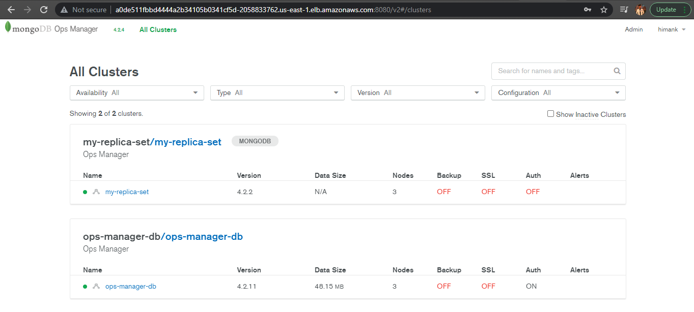

# Deploying mongoDB cluster in Kubernetes using Operator

* Create a namespace called mongodb 

```
kubectl create namespace mongodb
``` 
* Deploy the custom resources and operator in order to run mongodb database

```
kubectl apply -f https://raw.githubusercontent.com/mongodb/mongodb-enterprise-kubernetes/master/crds.yaml
```
```
kubectl apply -f https://raw.githubusercontent.com/mongodb/mongodb-enterprise-kubernetes/master/mongodb-enterprise.yaml
```

* Now in order to manage mongodb database It's recommended to use ops-manager created by mongodb community It will help us to maintain and manage the lifecycle of mongodb.

    * Now Create the secrets for passing admin user credentials on ops-manager
    ```kubectl create secret generic ops-manager-admin-secret  \
    --from-literal=Username="example@xyz.com" \
    --from-literal=Password="example@123" \
    --from-literal=FirstName="example" \
    --from-literal=LastName="example" -n mongodb 
    ```
    * Now Deploy the ops-manager
    ```
    kubectl apply -f opsManagerMongo.yaml 
    ```
    Note: Make sure you have at least 3 replicas and it is recommended to have at least 20 GB memory available
    
    *  Now to run database we required an api key which can be generated on ops-manage page under the organization section

    * Create a secret for passing api key to stateful set
    ```
    kubectl create secret generic himank-credentials  \
    --from-literal="user=example@xyz.com" \
    --from-literal="publicApiKey=xxxxxxx-9440-4b72-9b7b-xxxxxxxxxx"  -n mongodb
    ```

    * To get the url of ops-manager run this command
    ```
    kubectl get om ops-manager -o jsonpath='{.status.opsManager.url}' -n mongodb
    ```
    * Create a config map using the URL we get from above step
    ```
    kubectl create configmap ops-manager-connection  \
    --from-literal="baseUrl=http://ops-manager-svc.mongodb.svc.cluster.local:8080"  -n mongodb
    ```

    * Now deploy the database cluster on Kubernetes
    ``` 
    kubectl apply -f deploy-mongo.yaml 
    ```

    * See the dashboard running this command 
    ```
    kubectl get svc -n mongodb
    ```

    Attached screenshot below

    